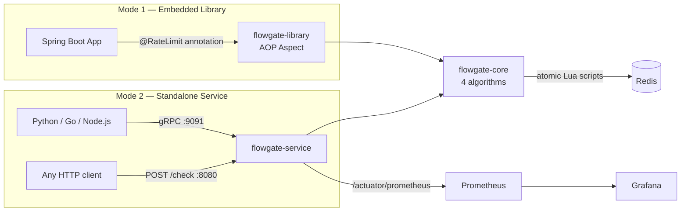
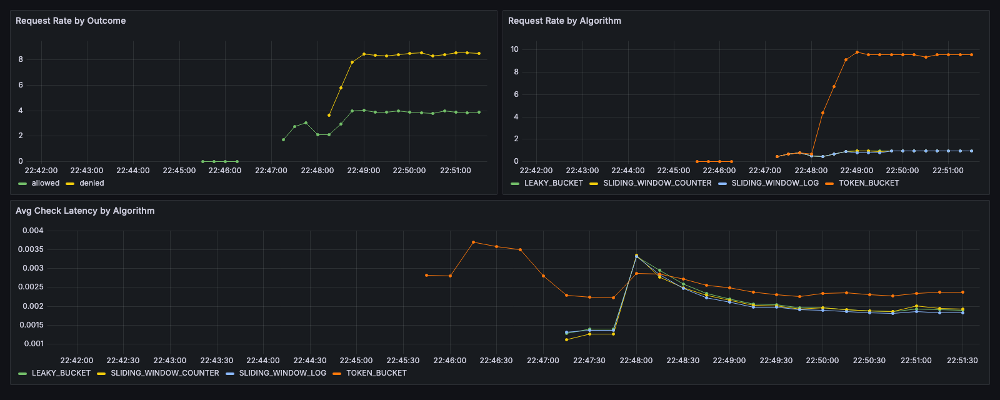
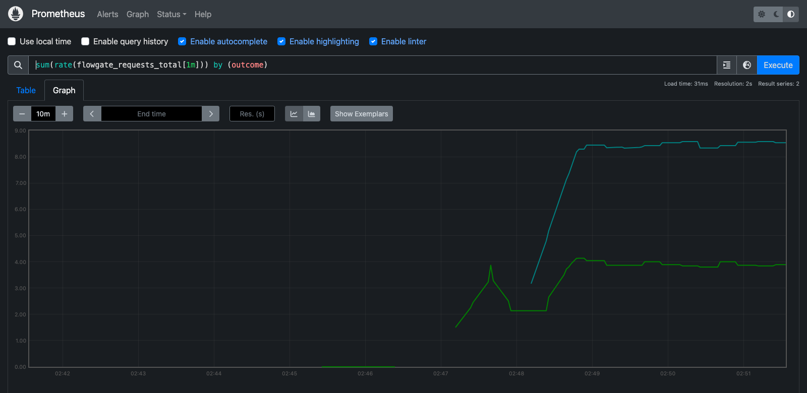

# flowgate

[](https://github.com/sodikjonismoilov/flowgate/actions/workflows/ci.yml?query=branch%3Adevelop)
[](https://openjdk.org/projects/jdk/21/)
[](https://spring.io/projects/spring-boot)
[](https://redis.io/docs/latest/develop/interact/programmability/eval-intro/)

> **A distributed rate limiter built as an AI-gateway component.**
> Four algorithms, Redis-backed with atomic Lua scripts, shipped two ways:
> an embeddable Spring Boot library and a standalone gRPC/HTTP service.

---

## The problem this solves

An AI gateway sits in front of expensive, slow, capacity-constrained model backends.
Every request costs real money and occupies a scarce inference slot, so the gateway's
first job is to decide — in under a millisecond, correctly, across every replica — whether
this caller is allowed through right now.

That "across every replica" clause is what makes it interesting. An in-process counter is
trivial and wrong: with four gateway pods, a tenant limited to 100 req/min actually gets 400.
Correctness requires shared state, and shared state requires that the read-decide-write cycle
be **atomic** — otherwise two pods both read `tokens=1` and both allow the request.

Flowgate solves that with Redis and Lua, and packages the result so it can be adopted
either as a library (one annotation) or as a service (one RPC).

```java
@RateLimit(algorithm = TOKEN_BUCKET, key = "#apiKey", limit = 10, window = "PT1M")
@PostMapping("/v1/completions")
public CompletionResponse complete(@RequestHeader("X-API-Key") String apiKey,
                                   @RequestBody CompletionRequest request) { ... }
```

Each distinct API key gets its own independent Redis-backed quota. One tenant exhausting
their limit has zero effect on any other — proven by the `differentKeysAreTrackedIndependently`
test on every Redis-backed algorithm, and visible end-to-end in the dashboard below.

---

## Two integration modes, one core

**Mode 1 — Embedded library.** Add the JAR, annotate a method. Spring Boot auto-discovers
`FlowgateAutoConfiguration`, which registers the `RedisClient` and the `RateLimitAspect`;
any `@RateLimit`-annotated method is enforced from then on. No configuration required.

**Mode 2 — Standalone service.** A language-agnostic checkpoint for polyglot infrastructure —
your Python and Go services get the same limiter as your Java ones.

```
POST /check
{ "tenantId": "acme", "key": "user:42", "algorithm": "TOKEN_BUCKET",
  "limit": 100, "windowMillis": 60000 }

→ { "allowed": true, "remaining": 73, "retryAfterMillis": 0 }
```

The same call over gRPC is `RateLimitService/Check`. Both transports decode into the same
`RateLimitCheckRequest` and delegate to the same `RateLimitCheckService` — there is exactly
one enforcement path, so the two transports cannot drift apart.



| Module | Directory | Role | Spring dependency |
|---|---|---|---|
| `flowgate-core` | `core/` | Algorithms + Redis integration | None — pure Java |
| `flowgate-library` | `library/` | `@RateLimit` annotation + AOP wiring | Spring Boot (AOP) |
| `flowgate-service` | `service/` | Standalone gRPC/HTTP server | Spring Boot (Web, Actuator) |
| `flowgate-benchmark` | `benchmark/` | JMH microbenchmarks | None |

> **Build gotcha:** module directory names do **not** match artifactIds, so `-pl` needs the
> colon-prefixed artifactId form. `mvn -pl service ...` fails; use:
> ```bash
> mvn clean install -pl :flowgate-service -am
> ```

---

## The four algorithms

Each is implemented twice — once in-memory (lock-free CAS loop, for single-process use and as
the benchmark baseline) and once Redis-backed (atomic Lua, for distributed use). Both satisfy
the same `RateLimiter` interface, so switching is a one-line change.

| Algorithm | Burst handling | Memory per key | Accuracy | Real-world use |
|---|---|---|---|---|
| **Token Bucket** | Allows bursts up to the burst capacity | O(1) — 2 fields | Approximate at window edges | AWS API Gateway, Stripe |
| **Leaky Bucket** | Smooths everything to a constant drain rate | O(1) — 2 fields | Approximate | Protecting a fragile downstream |
| **Sliding Window Log** | N/A — every request timestamped | **O(n)** — one entry per request | **Exact** | Precision-critical, low-volume APIs |
| **Sliding Window Counter** | Controlled | O(1) — 2 counters | Very good | Cloudflare's production default |

### Why you'd pick each one

**Token Bucket** is the default for API gateways because it matches how clients actually behave:
idle for a while, then a quick burst. Tokens accumulate up to a burst ceiling while you're idle,
so a client that has been quiet is allowed a short burst — but the long-run average is still
pinned to the configured rate. Flowgate's `RateLimiterConfig.tokenBucket()` defaults burst
capacity to **2× the per-window limit**, which is why `limit = 10, window = PT1M` in the demo
actually admits up to 20 requests in a cold burst before it starts returning 429.

**Leaky Bucket** is the right answer when the thing you're protecting cannot absorb bursts at all —
a legacy database, a single-threaded downstream. It deliberately throws away the burst
tolerance that makes token bucket pleasant, in exchange for a perfectly flat output rate.

**Sliding Window Log** is the only one that is *exactly* right. It stores a timestamp per request
in a Redis sorted set and counts what falls inside the window. The cost is honest and linear:
a key doing 10,000 req/min stores 10,000 entries. Use it when a customer contract says
"exactly 100 requests" and being off by three at a window boundary is a real problem.

**Sliding Window Counter** is the pragmatic favorite, and the interesting bit of math:

```
effective_count = current_window_requests
                + previous_window_requests × (1 − elapsed_fraction)
```

It keeps two counters and linearly blends the previous window's count by how much of the
current window has elapsed. That approximates a true sliding window in **O(1)** space, and it
kills the fixed-window boundary exploit (fire your full quota at 11:59:59 and again at 12:00:00
to get 2× the limit in one second) without paying the log's per-request storage cost. It assumes
traffic was uniformly distributed across the previous window, which is where its small
inaccuracy comes from.

---

## Redis atomicity: why Lua, not WATCH/MULTI/EXEC

Every algorithm's decision is a read-modify-write:

```
tokens = GET key            # read
tokens = refill(tokens)     # decide
SET key tokens-1            # write
```

Run that from two gateway pods concurrently and both read `tokens = 1`, both decide "allowed",
and both write `tokens = 0`. The limit is silently doubled. This is the entire correctness
problem, and it is a race, so it shows up under exactly the load where you most need the limiter
to work.

Redis offers two ways to make the cycle atomic:

| Approach | How it works | Why not / why yes |
|---|---|---|
| `WATCH`/`MULTI`/`EXEC` | Optimistic locking — abort and retry if the key changed | Client-side retry loop; **round trips scale with contention**, which is worst precisely under heavy load. Also can't be used naively with connection pooling. |
| **`EVAL` (Lua)** ✅ | Script runs inside Redis, single-threaded, to completion | **One round trip, zero retries, no contention path.** Redis executes it as one indivisible unit. |

Flowgate uses Lua. Each of the four Redis limiters ships a script that does the whole
read-decide-write in one server-side hop and returns a 3-element array —
`[allowed, remaining, retryAfterMillis]` — so a single network round trip produces the complete
answer the caller needs, including the `Retry-After` value.

From `RedisTokenBucketRateLimiter`:

```lua
local state       = redis.call('HMGET', key, 'tokens', 'last_refill')
local tokens      = tonumber(state[1])
local last_refill = tonumber(state[2])

if tokens == nil then                      -- first request: full bucket
    tokens = burst; last_refill = now
end

local elapsed = now - last_refill          -- refill by elapsed time
tokens = math.min(burst, tokens + elapsed * refill_rate)

if tokens < requested then                 -- reject, and say when to retry
    return {0, math.floor(tokens), math.ceil((requested - tokens) / refill_rate)}
end

tokens = tokens - requested
redis.call('HMSET', key, 'tokens', tostring(tokens), 'last_refill', tostring(now))
redis.call('PEXPIRE', key, window_ms * 2)  -- idle keys expire themselves
return {1, math.floor(tokens), 0}
```

Two details worth pointing at in review:

- **`now` is passed in as an argument (`ARGV[4]`), not read via `redis.call('TIME')`.** Reading
  the clock inside the script would make it non-deterministic, which historically broke
  replication and still makes the script untestable against a fake clock. Passing time in keeps
  the script a pure function of its inputs.
- **`PEXPIRE` on every write, set to 2× the window.** Rate limit keys are unbounded in
  cardinality — one per API key, per user, per IP. Without a TTL, Redis memory grows forever
  with the number of distinct callers you have ever seen. Two windows is enough for any
  algorithm's state to have gone stale.

---

## Engineering callout: the `FailSafeRateLimiter` lazy-`Supplier` bug

This one is worth reading the diff for, because the naive version passes every test and
fails in exactly the situation it was written to handle.

`FailSafeRateLimiter` is a decorator that wraps any `RateLimiter` and decides what happens
when the backend is unreachable — fail **open** (allow, prioritize availability) or fail
**closed** (reject, prioritize protection). It catches only `RedisException`, deliberately not
`RuntimeException`, so a genuine bug elsewhere is never silently reinterpreted as "Redis is down."

The bug was in **when the delegate gets constructed.** The obvious signature is:

```java
// BROKEN — delegate built by the caller, before the try/catch exists
public FailSafeRateLimiter(RateLimiterConfig config, RateLimiter delegate, FailurePolicy policy)
```

The Redis-backed limiters **open their connection in their constructor**. So with an eager
delegate, `new RedisTokenBucketRateLimiter(config, redisClient)` is evaluated *at the call site*,
before `FailSafeRateLimiter` exists to catch anything. If Redis is down at that moment, the
constructor throws, the exception propagates past the decorator entirely, and the failure policy
never runs — the application dies at startup instead of failing open. The one scenario the class
exists for is the one scenario it cannot handle.

The fix is to take a `Supplier<RateLimiter>` and build the delegate lazily, **inside the same
try/catch as the call**:

```java
private final Supplier<RateLimiter> delegateSupplier;
private volatile RateLimiter delegate;

@Override
public RateLimitResult tryAcquire(String key, int tokens) {
    try {
        return delegate().tryAcquire(key, tokens);   // construction happens in here
    } catch (RedisException e) {
        log.warn("Rate limiter backend unreachable for key={}, applying {} policy", key, policy, e);
        return switch (policy) {
            case FAIL_OPEN   -> RateLimitResult.allowed(config.limit(), config.limit(), ...);
            case FAIL_CLOSED -> RateLimitResult.rejected(config.limit(), ..., Duration.ofSeconds(1));
        };
    }
}

private RateLimiter delegate() {          // double-checked locking, volatile field
    RateLimiter d = delegate;
    if (d == null) {
        synchronized (this) {
            d = delegate;
            if (d == null) { d = delegateSupplier.get(); delegate = d; }
        }
    }
    return d;
}
```

Now a connection failure at construction time is a `RedisException` thrown *inside* the
try block, so it becomes a fail-open/fail-closed decision like every other Redis failure.
The field is `volatile` with double-checked locking so concurrent first-callers can't
each build their own connection.

The general lesson: **a decorator that handles failures from an object it did not construct
has a hole exactly the size of that object's constructor.** Both call sites —
[`RateLimitAspect`](library/src/main/java/com/flowgate/library/aspect/RateLimitAspect.java)
and [`RateLimitCheckService`](service/src/main/java/com/flowgate/service/ratelimit/RateLimitCheckService.java)
— pass a `Supplier`, not an instance.

Default policy is **`FAIL_OPEN`**, overridable via `flowgate.failure-policy`. For an AI gateway
that is the right default: a rate limiter outage should not become a total outage. Flip it to
`FAIL_CLOSED` when the thing behind the gate is more expensive than the traffic is valuable.

---

## Observability

The service exposes Micrometer metrics at `/actuator/prometheus`:

| Metric | Type | Tags | What it tells you |
|---|---|---|---|
| `flowgate_requests_total` | counter | `algorithm`, `outcome` | allowed vs denied rate — your 429 rate |
| `flowgate_check_duration_seconds` | timer | `algorithm` | how long the limiter itself costs |

Both the annotation path (`RateLimitAspect`) and the service path (`RateLimitCheckService`)
increment the same meters, so one dashboard covers both integration modes.



*Real capture. Two tenants against `POST /v1/completions`: `acme-corp-key` deliberately driven
past its 10/min (burst 20) token-bucket quota, `widgetco-key` staying under. The denied series
climbing to ~8.4/s while allowed holds flat at ~4/s is per-key isolation working — one tenant
saturating their bucket does not touch the other's. Latency holds at ~2ms across all four
algorithms.*



*The same signal straight from Prometheus: `sum(rate(flowgate_requests_total[1m])) by (outcome)`.*

### Structured logging with correlation IDs

Every request carries a correlation ID, propagated from an inbound `X-Correlation-Id` header
or generated, and echoed back on the response. It lives in SLF4J's MDC, and
[`logback-spring.xml`](service/src/main/resources/logback-spring.xml) serializes the MDC as
top-level JSON fields, so `correlationId` is a queryable field in Loki/ELK — not text buried
in a message:

```json
{"@timestamp":"2026-08-10T22:45:55.266064-04:00","message":"Rate limit check: key=verify-key, algorithm=TOKEN_BUCKET, allowed=true, remaining=19","logger":"com.flowgate.library.aspect.RateLimitAspect","thread":"http-nio-8080-exec-4","level":"DEBUG","correlationId":"final-check","service":"flowgate-service"}
```

Two transports, two mechanisms, because their threading models differ:

- **REST** — [`CorrelationIdFilter`](service/src/main/java/com/flowgate/service/logging/CorrelationIdFilter.java)
  sets MDC once per request and clears it in a `finally`. One thread handles the whole request,
  so once is enough. The `finally` is not optional: without it a pooled Tomcat thread carries a
  stale ID into the *next* request it serves.
- **gRPC** — [`CorrelationIdGrpcInterceptor`](service/src/main/java/com/flowgate/service/logging/CorrelationIdGrpcInterceptor.java)
  wraps **each callback individually** (`onMessage`, `onHalfClose`, `onComplete`, `onCancel`).
  gRPC's async model may dispatch those callbacks on *different* pooled threads, and MDC is
  thread-local — so setting it once at call start would leave most of the call's log lines
  without an ID.

JSON output is on for the `json`, `docker`, and `prod` profiles; local runs get a
human-readable console line with `[correlationId]` inline.

---

## Benchmarks

Two layers are measured, because they answer different questions: **JMH** measures the limiter
algorithm itself, and an **HTTP load test** measures what a caller actually experiences through
the whole service.

### Layer 1 — JMH: the algorithms

> Apple M3 Pro, macOS · Temurin JDK 25.0.2 · Redis 7.2-alpine in Docker Desktop
> · JMH 1.37, 1 fork, 3×1s warmup, 5×1s measurement, single-threaded
> · `java -jar benchmark/target/benchmarks.jar -f 1 -wi 3 -i 5 -r 1s -w 1s`

| Algorithm | Backend | Throughput (ops/s) | p50 | p99 | p99.9 |
|---|---|---:|---:|---:|---:|
| Token Bucket | in-memory | **16,343,067** ± 603,390 | 0.083 µs | 0.125 µs | 0.63 µs |
| Token Bucket | Redis | **3,502** ± 721 | 255 µs | 536 µs | 1.11 ms |
| Leaky Bucket | in-memory | **15,901,464** ± 367,847 | 0.083 µs | 0.125 µs | 0.46 µs |
| Leaky Bucket | Redis | **3,808** ± 460 | 255 µs | 497 µs | 1.40 ms |
| Sliding Window Log | in-memory | **17,952,872** ± 1,704,186 | 0.083 µs | 0.125 µs | 0.74 µs |
| Sliding Window Log | Redis | **3,044** ± 4,032 ⚠️ | 248 µs | 485 µs | 1.11 ms |
| Sliding Window Counter | in-memory | **15,996,541** ± 1,789,392 | 0.083 µs | 0.125 µs | 4.90 µs |
| Sliding Window Counter | Redis | **3,707** ± 914 | 262 µs | 652 µs | 2.70 ms |

**What this actually says:**

- **The algorithm is never the bottleneck.** In-memory, all four land within ~13% of each
  other at 16–18M ops/s and a p99 of 0.125 µs. The choice between them is a *semantics*
  decision — burst tolerance, memory, exactness — not a performance one. Anyone optimizing
  which algorithm to use for speed is optimizing the wrong thing.
- **~4,700× throughput gap, and it's all network.** Redis-backed p50 is ~250 µs while
  in-memory p50 is 0.083 µs. The Lua script executes in microseconds; the round trip
  dominates completely. This is the number that justifies the whole Lua design: at ~250 µs
  per hop, a `WATCH`/`MULTI`/`EXEC` retry loop paying two or three round trips under
  contention would cost 500–750 µs for the same decision.
- **Caveat, stated plainly:** ~3.5k ops/s is *low* for local Redis. This is Docker Desktop on
  macOS, whose VM network layer adds ~150 µs of floor per round trip (the fastest observed
  sample, p0.00, is already 140–161 µs). Native Linux Redis on a real network would be
  substantially faster. The in-memory numbers are unaffected by this. Treat the Redis column
  as *relative* comparison, not an absolute ceiling.
- ⚠️ **Sliding Window Log / Redis has an error bar wider than its score** (±4,032 on 3,044) —
  it's the one result here that isn't trustworthy, and honesty is cheaper than pretending.
  Its `ZREMRANGEBYSCORE` + `ZADD` + `ZCARD` work is O(n) in entries per window, so its cost
  varies with how full the sorted set happens to be at sampling time. Its *latency*
  percentiles were stable; only throughput was noisy. More forks and longer iterations would
  settle it.

### Layer 2 — HTTP: what a caller sees

> ApacheBench, same machine, service running against Dockerized Redis.

**`POST /check`** — 5,000 requests, 50 concurrent, limit set high so everything is allowed:

```
Requests per second:    6167.11 [#/sec] (mean)
Failed requests:        0

  50%      7 ms
  90%     11 ms
  95%     13 ms
  99%     18 ms
 100%     45 ms (longest request)
```

Note that 6,167 req/s through the full HTTP service *exceeds* JMH's ~3,500 ops/s for the same
Redis limiter. That is not a contradiction — JMH measured a **single thread**, where every
request pays the full serial round trip. The service overlaps 50 concurrent requests against a
Redis that is idle most of the time, so the round trip is hidden by concurrency rather than
eliminated. Latency per request is unchanged; only utilization improved.

**`POST /v1/completions`** — the 429 behavior, 1,000 requests at 25 concurrent against one
cold API key limited to `limit = 10, window = PT1M`:

```
Complete requests:      1000
Non-2xx responses:      980        ← 429 Too Many Requests
                                     (1000 − 980 = exactly 20 allowed)
  50%      4 ms
  99%     12 ms
```

**Exactly 20 requests were allowed.** That is the burst capacity — `RateLimiterConfig.tokenBucket()`
sets it to 2× the per-window limit — and 980 concurrent requests racing 25-wide could not push a
single extra token out of the bucket. That number is the atomicity guarantee, empirically: if
the Lua script were not atomic, the races would have leaked extra allowances and the count
would have come out above 20.

A second, untouched API key issued 15 requests during the same window and got `200` fifteen
times out of fifteen — per-key isolation holding under load, not just in a unit test.

### Reproducing

```bash
docker compose up -d redis
mvn -B clean package -Pbenchmarks -DskipTests
java -jar benchmark/target/benchmarks.jar                  # full run, ~2m20s
java -jar benchmark/target/benchmarks.jar ".*inMemory"     # no Redis needed
java -jar benchmark/target/benchmarks.jar -prof gc         # allocation per op
```

```bash
# point the Redis benchmarks at a non-local Redis
java -Dflowgate.bench.redis.host=10.0.0.5 -jar benchmark/target/benchmarks.jar ".*redis"
```

For a richer HTTP picture than ApacheBench gives — ramping VU stages, separate p50/p99
thresholds per surface, and a scripted two-tenant isolation scenario — there is a k6 script at
[`loadtest/ratelimit-loadtest.js`](loadtest/ratelimit-loadtest.js):

```bash
brew install k6
mvn -pl :flowgate-service -am spring-boot:run    # in another terminal
k6 run loadtest/ratelimit-loadtest.js
```

It runs three scenarios — a `hot_tenant` ramped to 25 VUs that is *expected* to 429 heavily, a
`polite_tenant` that stays inside the burst and must **never** 429 (a hard threshold failure if
it does), and a `check_endpoint` scenario — and writes a p50/p90/p95/p99 table plus
`loadtest/summary.json`.

---

## Running it locally

### Prerequisites
- Java 21+, Maven 3.9+
- Docker (Redis, Prometheus, Grafana, and the Testcontainers integration tests)
- [k6](https://k6.io) for the load test — `brew install k6`

### 1. Start the infrastructure

```bash
# Redis only — enough to run the service and the test suite
docker-compose up -d redis
docker exec flowgate-redis redis-cli ping     # → PONG
```

```bash
# Or the full observability stack: Redis + Prometheus + Grafana
docker-compose --profile observability up -d
# Grafana:    http://localhost:3000   (anonymous read-only; admin / flowgate to edit)
# Prometheus: http://localhost:9090
```

### 2. Build and test

```bash
mvn clean install -pl :flowgate-service -am
```

Testcontainers starts its own throwaway Redis for the integration tests, so Docker must be
running. Skip them with `-DskipTests` if you only want artifacts.

### 3. Run the service

```bash
mvn -pl :flowgate-service spring-boot:run
```

```bash
# ...or with structured JSON logging, the way it runs in a container
mvn -pl :flowgate-service spring-boot:run -Dspring-boot.run.profiles=json
```

```bash
# ...or from the executable fat jar produced by the build above
java -jar service/target/flowgate-service-1.0.0-SNAPSHOT.jar --spring.profiles.active=json
```

REST on `:8080`, gRPC on `:9091`.

### 4. Watch it return 429

`POST /v1/completions` is limited to 10/min per API key with a burst capacity of 20, so the
21st request in a cold burst is the first to be rejected:

```bash
for i in $(seq 1 25); do
  curl -s -o /dev/null -w "%{http_code} " \
    -X POST http://localhost:8080/v1/completions \
    -H 'Content-Type: application/json' \
    -H 'X-API-Key: acme-corp-key' \
    -H "X-Correlation-Id: demo-$i" \
    -d '{"prompt":"hello"}'
done; echo
```

A second key is unaffected — swap `acme-corp-key` for `widgetco-key` and you are back to 200s.

---

## Testing

```bash
mvn test                          # everything
mvn -pl :flowgate-core test       # core only
```

Every algorithm has both in-memory unit tests (driven by an injectable `NanoClock`, so time is
deterministic rather than `Thread.sleep`-based) and Redis integration tests against a real
Testcontainers Redis — because Lua script behavior is exactly the kind of thing a mock would
let you get wrong.

---

## Engineering decisions

| Decision | Choice | Rationale |
|---|---|---|
| Redis client | **Lettuce** (over Jedis) | Netty-based, thread-safe connection sharing, first-class async/reactive path if the gateway later needs it. Jedis needs a connection pool for the same job. |
| Atomicity | **Lua `EVAL`** (over `WATCH`/`MULTI`/`EXEC`) | One round trip, no retry loop. Optimistic locking degrades exactly under the contention a rate limiter exists for. |
| Clock source | **Passed into the Lua script** | Keeps scripts deterministic (replication-safe) and lets tests drive time explicitly. |
| Key lifetime | **`PEXPIRE` = 2× window on every write** | Rate limit keys are unbounded cardinality; without TTL, Redis memory grows with every caller ever seen. |
| Failure policy | **`FAIL_OPEN` by default**, configurable | A rate limiter outage shouldn't become a total outage. Flip to `FAIL_CLOSED` when the protected resource is costlier than the traffic. |
| Delegate construction | **Lazy `Supplier`** | Redis limiters connect in their constructor; eager construction bypasses the failure policy entirely. See the callout above. |
| Limiter caching | **`ConcurrentHashMap` keyed on `algorithm:limit:window`** | One limiter instance (and one Lua script cache entry) per distinct annotation config, not per request. |
| Transport | **gRPC primary, REST fallback** | gRPC for the sub-millisecond internal hot path; REST so nothing is locked out. Both funnel into one `RateLimitCheckService` so they cannot diverge. |
| Log format | **JSON via `logstash-logback-encoder`**, profile-gated | MDC becomes queryable fields. Plain text locally, JSON in containers. |

---

## Project layout

```
flowgate/
├── core/                  flowgate-core — algorithms, Redis + Lua, no Spring
│   └── src/main/java/com/flowgate/core/
│       ├── RateLimiter.java, RateLimiterConfig.java, RateLimitResult.java
│       ├── FailSafeRateLimiter.java, FailurePolicy.java
│       ├── inmemory/      4 lock-free CAS implementations
│       └── redis/         4 Lua-script implementations
├── library/               flowgate-library — @RateLimit + AOP + autoconfiguration
├── service/               flowgate-service — REST :8080, gRPC :9091, actuator
│   └── src/main/
│       ├── proto/         gRPC service definition
│       └── resources/     application.yml, logback-spring.xml
├── benchmark/             flowgate-benchmark — JMH (profile: -Pbenchmarks)
├── loadtest/              k6 script — real p50/p99 and 429 behavior
├── config/                prometheus.yml + Grafana provisioning & dashboards
├── docs/images/           dashboard screenshots
└── .github/workflows/     CI
```

See [ARCHITECTURE.md](ARCHITECTURE.md) for a deeper walkthrough of the core contracts and
algorithm internals.

---

## Roadmap

- [x] **Week 1** — Token Bucket, in-memory, with unit tests
- [x] **Week 2** — All four algorithms, in-memory, common `RateLimiter` interface
- [x] **Week 3** — Redis backend + atomic Lua scripts + Testcontainers integration tests
- [x] **Week 4** — Spring Boot library (`@RateLimit` annotation + AOP aspect)
- [x] **Week 5** — Standalone gRPC service + REST fallback
- [x] **Week 6** — JMH benchmarks + k6 load test
- [x] **Week 7** — Prometheus metrics, Grafana dashboard, structured JSON logging, CI
- [ ] **Week 8** — Docker image + K8s manifests, demo video, v1.0 release tag
