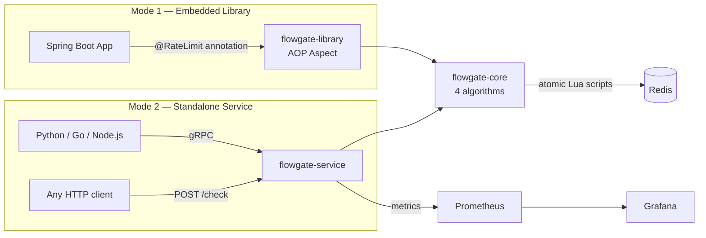

# flowgate

> Distributed rate limiter — embeddable Java library and standalone gRPC service.  
> Four algorithms. Redis-backed with atomic Lua scripts. Benchmark-driven.

## What it does

Two ways to use Flowgate, one core:

**Mode 1 — Embedded library.** Drop the JAR into any Spring Boot app, annotate an endpoint:

```java
@RateLimit(algorithm = TOKEN_BUCKET, key = "#userId", limit = 100, window = "1m")
@GetMapping("/api/data")
public Data getData(@PathVariable String userId) { ... }
```

**Mode 2 — Standalone service.** Language-agnostic gRPC/HTTP endpoint for polyglot infra:

```
POST /check
{ "key": "user:42", "limit": 100, "window": "1m", "algorithm": "TOKEN_BUCKET" }

→ { "allowed": true, "remaining": 73, "resetAt": 1720000060, "retryAfter": null }
```

---

## Architecture



---

## Modules

| Module | Role | Spring dependency |
|---|---|---|
| `flowgate-core` | Algorithms + Redis integration | None — pure Java |
| `flowgate-library` | `@RateLimit` annotation + Spring AOP wiring | Spring Boot (AOP) |
| `flowgate-service` | Standalone gRPC/HTTP server | Spring Boot (Web, Actuator) |
| `flowgate-benchmark` | JMH microbenchmarks | None |

---

## Algorithms

| Algorithm | Burst handling | Memory | Accuracy | Used by |
|---|---|---|---|---|
| **Token Bucket** | ✅ Allows bursts up to N | Low | Moderate | AWS API Gateway, Stripe |
| **Leaky Bucket** | ❌ Smooths all traffic | Low | Moderate | Downstream protection |
| **Sliding Window Log** | N/A | High (1 entry/request) | ✅ Exact | Precision-critical APIs |
| **Sliding Window Counter** | Controlled | ✅ Low (2 counters) | Good | Cloudflare (production default) |

The sliding window counter formula (the interesting part):
```
effective_count = current_window_requests
                + previous_window_requests × (1 - elapsed_fraction)
```
This weighted blend approximates a true sliding window with O(1) space.

---

## Getting started

### Prerequisites
- Java 21+
- Maven 3.9+
- Docker (for Redis, Prometheus, Grafana)

### Start Redis (all you need for Weeks 1–5)
```bash
docker-compose up -d redis

# Verify Redis is up
docker exec flowgate-redis redis-cli ping   # → PONG
```

### Build all modules
```bash
mvn clean install
```

### Start the standalone service
```bash
# After Week 3+ when the service has an implementation:
mvn -pl service spring-boot:run

# Or with Docker:
docker build -t flowgate-service ./service
docker run -p 8080:8080 -e REDIS_HOST=host.docker.internal flowgate-service
```

### Run benchmarks (Week 6+)
```bash
mvn -pl benchmark package -DskipTests
java -jar benchmark/target/benchmarks.jar
```

### Full observability stack (Week 7+)
```bash
docker-compose --profile observability up -d
# Prometheus: http://localhost:9090
# Grafana:    http://localhost:3000  (admin / flowgate)
```

---

## Engineering decisions

> Added progressively as the project develops. Each entry documents WHY a choice was made — the tradeoffs, not just the outcome.

| Decision | Choice | Rationale |
|---|---|---|
| Redis client | Lettuce (async) vs Jedis (sync) | _TBD — Week 3_ |
| Atomicity strategy | Lua scripts vs WATCH/MULTI/EXEC | _TBD — Week 3_ |
| Fail behavior | Fail-open vs fail-closed | _TBD — Week 3_ |
| Default algorithm | Which one to recommend | _TBD — Week 6 (after benchmarks)_ |
| gRPC vs REST | Transport choice for standalone service | _TBD — Week 5_ |

---

## Benchmarks

> Added in Week 6 after JMH runs.

```
Algorithm               Throughput (ops/sec)   p99 latency
---------------------------------------------------------------
Token Bucket            TBD                    TBD
Leaky Bucket            TBD                    TBD
Sliding Window Log      TBD                    TBD
Sliding Window Counter  TBD                    TBD
```

---

## Roadmap

- [ ] **Week 1** — Token Bucket, in-memory, with unit tests
- [ ] **Week 2** — All four algorithms, in-memory, common `RateLimiter` interface
- [ ] **Week 3** — Redis backend + atomic Lua scripts + Testcontainers integration tests
- [ ] **Week 4** — Spring Boot library (`@RateLimit` annotation + AOP aspect)
- [ ] **Week 5** — Standalone gRPC service + REST fallback
- [ ] **Week 6** — JMH benchmarks, performance analysis, documented optimization
- [ ] **Week 7** — Prometheus metrics, Grafana dashboard, Docker + K8s deployment
- [ ] **Week 8** — README polish, demo video, blog post, v1.0 release tag

---

## Local development

```bash
# Run tests (Testcontainers will spin up Redis automatically)
mvn test

# Run only core module tests
mvn -pl core test

# Check code compiles cleanly across all modules
mvn compile
```
